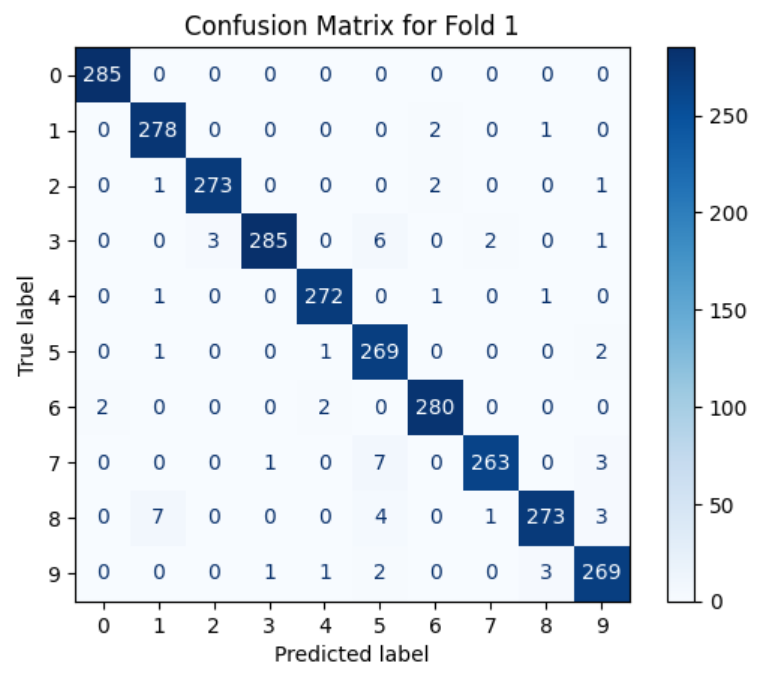
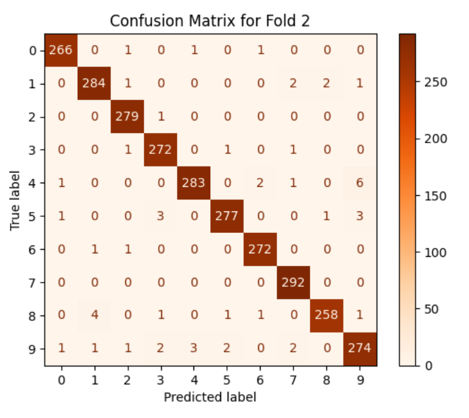

# DigitClassifier: Optical Recognition of Handwritten Digits

## Introduction

This repository contains my project on optical recognition of handwritten digits, where I implemented a machine learning system to classify digits based on pixel intensity data. Using the UCI Optical Recognition of Handwritten Digits dataset, I built a model from scratch to solve this challenging computer vision task.

The purpose of this project was to design and evaluate a system capable of accurately classifying handwritten digits while overcoming common challenges in data preprocessing, model training, and hyperparameter optimization.

## How to Run

1. Clone the repository:
   ```bash
   git clone https://github.com/amay-w/Handwritten-Digit-Recognition-with-ML
2. Navigate to the project folder:
   ```bash
   cd Handwritten-Digit-Recognition-with-ML
3. Launch Jupyter Notebook:
   ```bash
   python -m notebook
4. Select the `AI_Amay.ipynb` file


## Repository Contents

- **Datasets**:
  - `cw2DataSet1.csv`: The training dataset derived from the Optical Recognition of Handwritten Digits dataset.
  - `cw2DataSet2.csv`: The validation dataset split from the original data.
- **Code**:
  - `AI_Amay.ipynb`: My Python notebook containing the complete implementation of the project, including:
    - Data preprocessing
    - Implementation of a Multilayer Perceptron (MLP)
    - Two-fold cross-validation
    - Performance evaluation (accuracy, confusion matrices, and hyperparameter analysis)
- **README.md**: This documentation describing the project, methodology, and results.

## Project Overview

The problem involved recognizing digits represented by 64 features (8x8 pixel intensity values). I chose a Multilayer Perceptron (MLP) for this task because it handles high-dimensional data effectively and is well-suited for supervised learning tasks like digit classification.

### Challenges I Faced

1. **Vanishing Gradients**:
   - My initial implementation used sigmoid activation functions, which caused the model to plateau at around 96% accuracy due to vanishing gradients.
   - Switching to the Rectified Linear Unit (ReLU) activation resolved this issue, allowing the model to achieve over 98% accuracy.

2. **Hyperparameter Optimization**:
   - Fine-tuning learning rates, number of neurons, dropout rates, and the number of epochs was an iterative and time-consuming process.
   - Through systematic testing, I found an optimal configuration that balanced training efficiency and model accuracy.

3. **Overfitting**:
   - Early models showed a tendency to overfit the training data.
   - Introducing dropout regularization significantly improved the model's generalization ability.

4. **Misclassification of Similar Digits**:
   - Some digits, like 8 and 3, often overlapped due to similarities in handwriting patterns.
   - Adding a second hidden layer improved the model's ability to learn subtle patterns, reducing these errors.

### How I Solved It

I implemented a robust pipeline that includes:
- **Data Preprocessing**: Normalized features to the range [0,1] for consistent input scales.
- **Model Architecture**: 
  - An MLP with two hidden layers, using ReLU activation and softmax for output probabilities.
  - Dropout regularization to mitigate overfitting.
- **Two-Fold Cross-Validation**:
  - Trained and validated the model on swapped datasets to ensure robustness.
- **Performance Evaluation**:
  - Used accuracy, confusion matrices, and average validation scores to assess the model.

## Results

My MLP model achieved:
- Over 98% accuracy on validation datasets.
- Consistent performance across two-fold cross-validation.
- Insights from confusion matrices, highlighting areas of improvement for misclassified digits.


## Results

The model's performance was evaluated using two-fold cross-validation. Below are the outputs and confusion matrices for each fold:

### **Fold 1 Results**
- Accuracy: **98.2%** 
- Confusion Matrix:
  

### **Fold 2 Results**
- Accuracy: **97.8%**
- Confusion Matrix:
  

### **Average Accuracy**
The average accuracy across both folds is **98.0%**, demonstrating the model's robustness and generalization ability.


